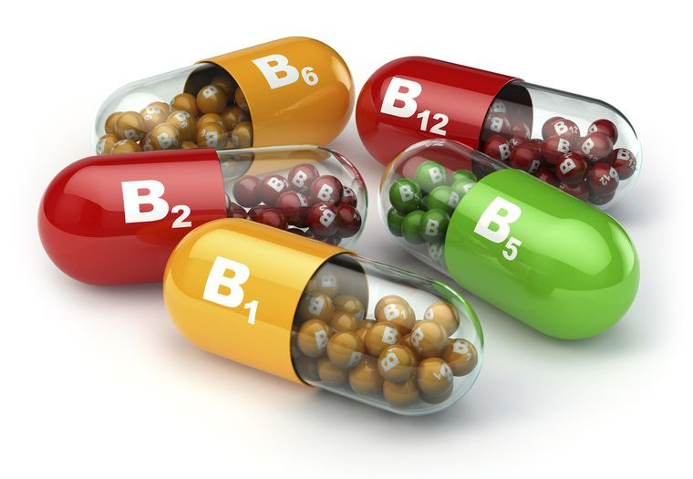
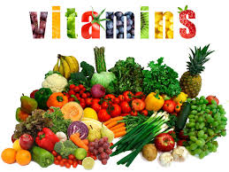

<!-- markdownlint-disable MD033 -->

# [Vitamin B]

<figure class="figure">
    
    <figcaption class="figure__caption">Vitamin B</figcaption>
</figure>

## O vitaminu B

Nutricionistički pioniri (v. Nutricionizam) tijekom dvadesetih i tridesetih godina 20. stoljeća su otkrivali veze između različitih vidova zdravlja i nekih kemijskih tvari u namirnicama. Nerijetko su se u svojim istraživanjima morali vraćati par koraka unazad. U trenutku otkrića navodnog prehrambenog ključa za neki važni tjelesni proces vratili su se istoj namirnici i u njoj pronašli posve drukčiju tvar, uključenu u isti ili sličan proces. Na kraju su shvatili da rade sa skupinom srodnih tvari, te tvari danas poznamo kao vitamine B-kompleksa.

## O vitaminima

<figure class="figure">
    
    <figcaption class="figure__caption">Vitamini</figcaption>
</figure>

itamini su esencijalni nutritijenti organskog porijekla i neizostavni su dio svake prehrane. Jedan od prvih otkrivenih vitamina je bio tiamin kojeg je otkrio poljski biohemičar Kazimierz Funk 1911. godine. Taj je naučnik smatrao da je otkrio supstancu važnu za život, a s obzirom na to da su hemičari svrstali tu tvar u grupu amina naziv je došao kombinacijom latinske riječi vita što znači život i pojma amin.

U početku, kada su se vitamini tek počeli otkrivati njihova hemijska struktura nije bila poznata. Tada je dogovorno da se dodjeljuju oznake koje su bile ili samo slova abecede ili kombinacija brojki i slova. Danas je, znanstvena javnost pronašla prikladne nazive za svaki pojedini vitamin: npr. tiamin (B1), riboflavin (B2), askorbinska kiselina (C), biotin (H), cijanokobalamin (B12) i dr. O njima ovise normalne funkcije ljudskog organizma.
