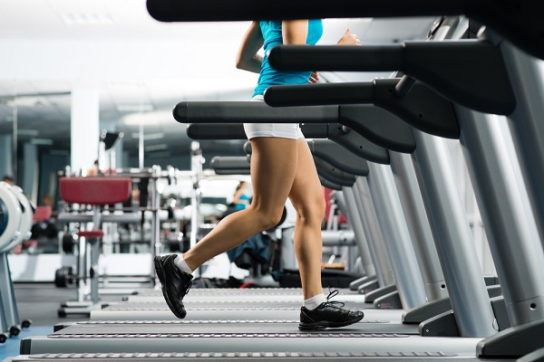
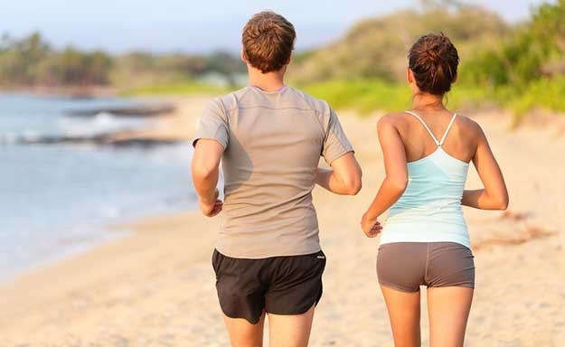

<!-- markdownlint-disable MD033 -->

# [Trening]

<figure class="figure">
    
    <figcaption class="figure__caption">Trening u teretani</figcaption>
</figure>

## Kako trenirati

TRENING s utezima najbolji je način za oblikovanje tijela, no ne postoji revolucionarni trening za početnike koji će dati velike rezultate preko noći. Ako nikada niste napravili trening u teretani i ne razlikujete sprave za mišiće leđa od onih za kvadriceps, onda je ovih nekoliko redaka upravo za Vas.

Tijelo početnika nije naviklo na opterećenja i zahtjeve takvog trenažnog procesa.

## Zdravo tijeko zdrav duh

<figure class="figure">
    
    <figcaption class="figure__caption">Zdrav život</figcaption>
</figure>

Kada govorimo o dobrobitima tjelesnog vježbanja za čovjekovo zdravlje možemo istaknuti dva smjera: jedan je unapređenje općeg zdravstvenog statusa, a drugi je prevencija bolesti. Od najranije životne dobi, zadatak tjelesnog vježbanja je pozitivno djelovati na rast i razvoj organizma te funkcionalnih sposobnosti organskih sistema. Nadalje, poticati pravilno držanje tijela, razvijati higijenske te prehrambene navike, ali svakako unaprijediti međuljudske odnose. Pri tjelesnom vježbanju velika je mogućnost za razvoj pozitivnih društvenih i moralnih osobina kao što su: timski rad, solidarnost, pravednost, odlučnost, smjelost, prisebnost, upornost, ustrajnost, discipliniranost, odgovornost, iskrenost, skromnost, optimizam, poštenje, kulturno ponašanje, patriotizam i dr.

Suvremeni način života često donosi simptome anksioznosti i stresa na koje većina osoba nisu imune. Glavni čimbenik kod kratkotrajnih promjena raspoloženja je tjelesno vježbanje ili rekreacija; kroz uživanje i zadovoljstvo u aktivnostima koje obavljamo (u društvu) pokušavamo doći do ključnih elemenata za psihičku dobrobit, a same aktivnosti nam barem neko vrijeme misli udaljuju od problema. Kada govorimo o dobrobitima za pojedinca moramo spomenuti uzročno–posljedičnu vezu koju ima tjelesno vježbanje na psihofizičko zdravlje. Povećanjem snage, izdržljivosti (općenito unapređenjem kondicije) ili smanjenjem tjelesne težine (ili drugih tjelesnih nedostataka poput lošeg držanja, nepravilnih nogu...) pojedinac dobiva bolje mišljenje o samom sebi što povećava percepciju vlastitih mogućnosti i sposobnosti, a samim time dolazi do rasta samopouzdanja te dodatne motivacije za nastavak tjelesnog vježbanja što će mu omogućiti postizanje viših ciljeva. Brojna istraživanja provedena na depresivnim ljudima (učenicima, studentima, radnicima) dokazala su da tjelesno vježbanje ima gotovo jednak učinak na zdravlje kao i psihoterapijske metode. U borbi protiv stresa vježbanje pomaže kao način izbacivanja negativne energije iz organizma. Vježbanje smanjuje nivo "hormona stresa" - kortizola, a povećava nivo endorfina - hormona zaslužnog za osjećaj sreće i prirodne energije. Vježbanje odvlači pažnju od izvora stresa te  istraživači potvrđuju da redovito vježbanje smanjuje osjetljivost na stres, ali i olakšava borbu s već postojećim stresom.
