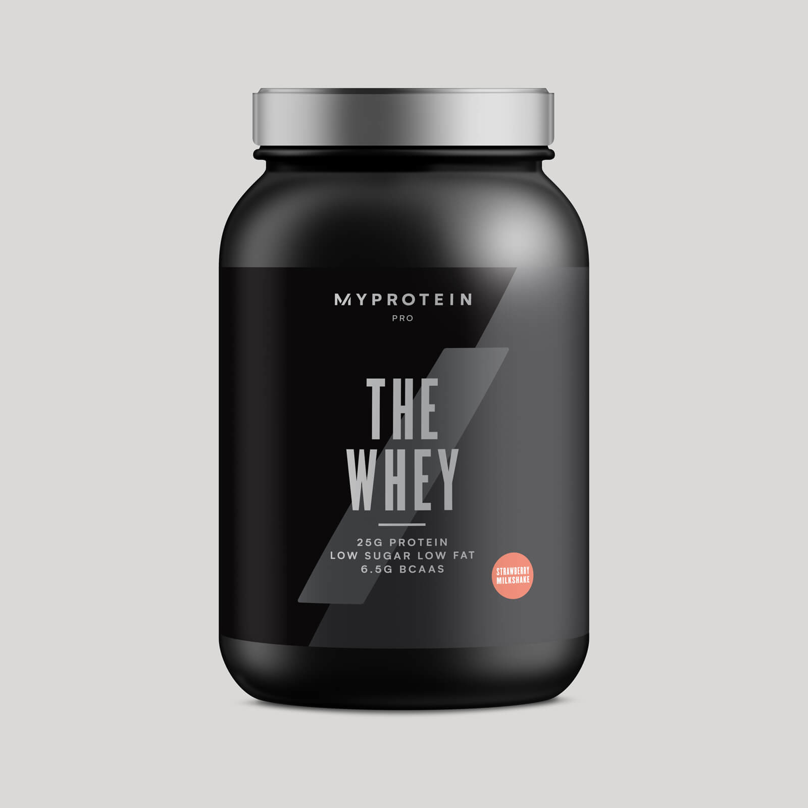

<!-- markdownlint-disable MD033 -->

# [Whey protein ]

<figure class="figure">
    
    <figcaption class="figure__caption">Whey protein</figcaption>
</figure>

## Što je whey protein

THE Whey je naš vrhunski protein sirutke, napravljen stručnim postupcima filtracije i od najboljih sastojaka.

Naša optimalna mješavina izolata, koncentrata i hidrolata proteina je posebno razvijena kako bi ti pomogla ostvariti mišićni rast koji trebaš, bez obzira na ciljeve.*

Ovaj izbor pobjednika postavlja novi standard sportske prehrane – pružajući nenadmašnu kvalitetu i okus s kojim ćeš ostati u vrhunskoj formi.

## Koje su prednosti THE Whey-a?

<figure class="figure">
    
    <figcaption class="figure__caption">Title</figcaption>
</figure>

S vodećih 25g proteina po porciji, i manje od 2g ugljikohidrata, 1g masti, i s 3g leucina, te preko 5g prirodno prisutnog glutamina – postavljamo novi standard.

Naš protein sirutke dolazi od istih krava od kojih se dobiva mlijeko i sir. Zatim se jednostavno filtrira, isparava i isušuje kako bi se proizveli prirodni nutrijenti.

THE Whey sadrži MyZyme®. Posebno kreiran za ovaj proizvod, pruža ti više proteaze od drugih mješavina enzima na tržištu – što znači da ćeš izdržati treninge snage bolje nego ikad prije.

Bez konkurencije po pitanju okusa i glatkoće, THE Whey je ukusan u kombinaciji s vodom ili mlijekom. Dostupan je u šest ukusnih okusa, uključujući Mliječnu Čokoladu, Slanu Karamelu, i Milkshake Od Jagode.
