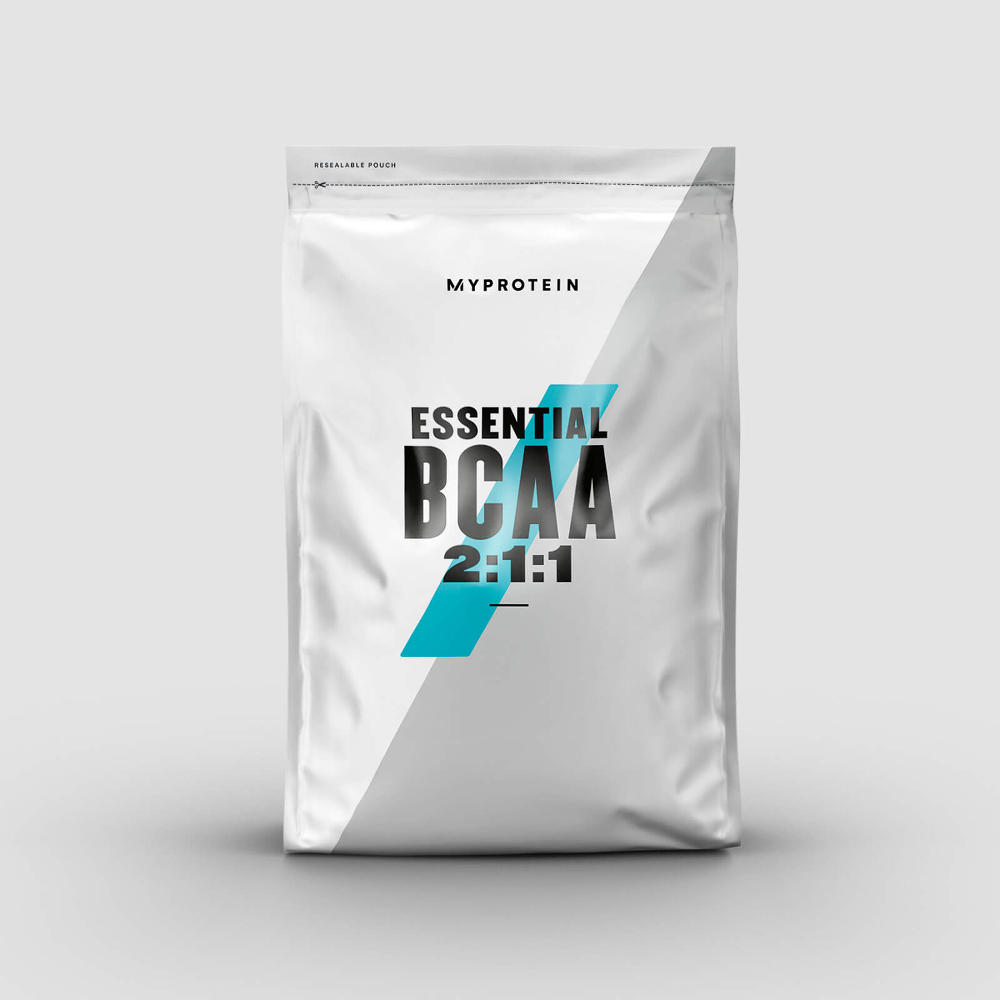
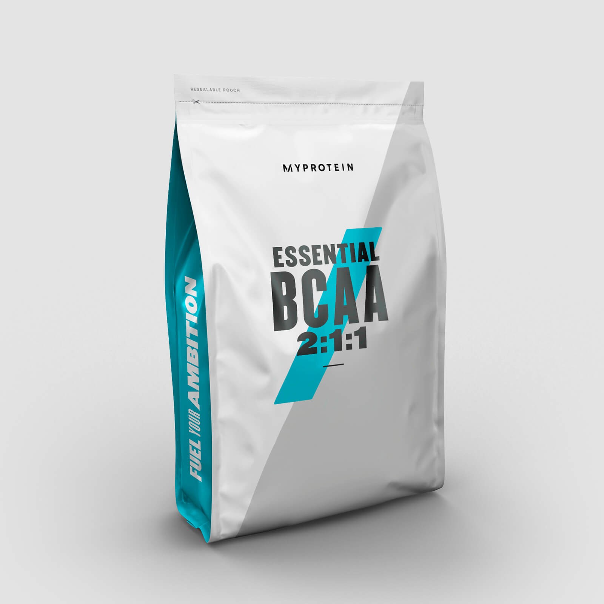

<!-- markdownlint-disable MD033 -->

# [BCAA](https://www.lipsum.com/)

<figure class="figure">
    
    <figcaption class="figure__caption">BCAA</figcaption>
</figure>

## Što je BCAA

Aminokiseline se dijele na esencijalne, dakle  one koje se mogu izgraditi u samom organizmu, i neesencijalne, koje čovjekov organizam nije u stanju napraviti, zato ih je neophodno unijeti kroz ishranu. Leucin, izoleucin i valin dio su prve kategorije i se nazivaju skupnim imenom BCAA. One imaju pozitivan utjecaj na rast i regeneraciju mišića. Leucin ima najjači utjecaj na stimulaciju sinteze mišićnog tkiva. Izoleucin povećava apsorpciju glukoze z mišićno tkivo, dok precizna uloga valina još nije sasvim određena. BCCA se uzima prije/tijekom/nakon treninga. Osim toga se koriste i za poboljšanje performansi organizma. Međutim, njihov mehanizam jačanja sposobnosti organizma drugačiji je od mehanizma djelovanja arginina, citrulina i beta alanina. Najbolji prirodni izvori BCAA su meso i jaja. 

## Još malo o BCAA

<figure class="figure">
    
    <figcaption class="figure__caption">BCAA</figcaption>
</figure>

Prozis Sport ponosno predstavlja BCAA Instant, snažnu mješavinu razgranatih lanaca aminokiselina koji će Vam dati nevjerojatne rezultate.

BCAA čine tri esencijalne aminokiseline u ljudima. Njihovo ime potječe od njihove razgranate kemijske strukture. BCAA Instant poboljšava snagu mišića i rast izravno stimulirajući sintezu mišićnih proteina. Nadalje, ubrzava oporavak mišića i smanjuje bol mišića.

Svaka BCAA Instant porcija od 5 grama sadrži savršen spoj od tri razgranata lanca aminokiselina L-leucin, Lizoleucin i L-valin u preciznom omjeru 2:1:1. Pomiješajte BCAA u prahu s toplom vodom ili s bilo kojim drugim napitkom po Vašem izboru. Ove BCAA odmah se apsorbiraju u mišiće te pružaju stalan i neprekidan protok energije tijekom treninga dok sprečavaju razgradnju Vaših mišića.

Prestanite se brinuti o smišljanju novih načina da biste izgradili mišiće, BCAA će to učiniti umjesto Vas.
